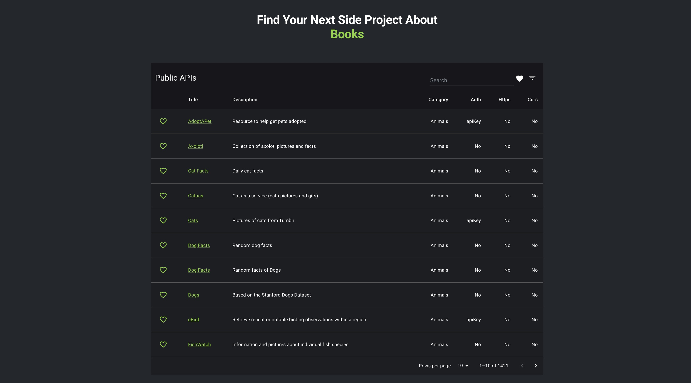

# Public APIs directory

A list of public APIs to help you find your next side project.

The data is sourced from the [public-apis](https://github.com/public-apis/public-apis) repository.

## Motivation

There are countless lists of public APIs that can be used to practice, but such lists normally are large and it ends up being overwhelmingly difficult to find something unless you know exactly what you are looking for.

In an attempt to solve this issue, I decided to build a frontend of my own that took one of the most popular lists of public APIs as its data source and allows the user to filter them by category, type of authentication required, name, etc.
## What can it do?

* Filter by category, type of authorization, use of https, or cors.
* Search by name or description
* Save your favorite ones by liking them
* Preservation of the state
* Share the filtered table thanks to the filter state being stored in the query string.

View the project live [here](https://public-apis-directory.netlify.app/).